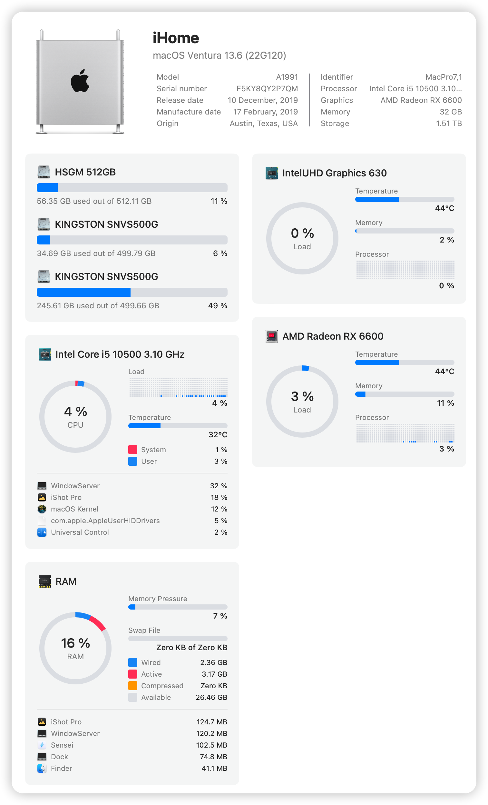

# GIGABYTE-Z590-G-i510500-5600XT-hackintosh

Install macOS Ventura on GIGABYTE Z590-Vison-G Mainboard with 10th Gen Intel CPU.



### Information 

- macOS: [Ventura](https://www.apple.com/macos/ventura/)
- bootloader: [OpenCore 0.9.2](https://github.com/acidanthera/OpenCorePkg/releases/tag/0.9.2)

### Hardware

| Component    | Variant                   | Link                                                                                                                                         |
|:------------:|:-------------------------:|:--------------------------------------------------------------------------------------------------------------------------------------------:|
| Mainboard    | GIGABYTE Z590-VISON-G | [www.gigabyte.com](https://www.gigabyte.com/Motherboard/Z590-VISION-G-rev-10)                                           |
| Processor    | Intel Core i5 10500      | [ark.intel.com](https://www.intel.com/content/www/us/en/products/sku/199277/intel-core-i510500-processor-12m-cache-up-to-4-50-ghz/specifications.html)     |
| DDR4 RAM     | Corsair 32GB   | [www.corsair.com](https://www.corsair.com/ja/zh/%E7%B1%BB%E5%88%AB/%E4%BA%A7%E5%93%81/%E5%86%85%E5%AD%98/VENGEANCE-LPX/p/CMK128GX4M4A2666C16)|
| NVMe SSD     | Kingston 512GB              | [www.kingston.com](https://www.kingston.com.cn/en/ssd/dc1000b-data-center-boot-ssd)                                                          |
| Graphics     | AMD RX 5600XT 6G (sapphire)   | [www.sapphiretech.com](https://www.sapphiretech.com/en/consumer/pulse-radeon-rx-5600-xt-be-6g-gddr6)                                        |
| WiFi / BT    | BCM94360CD                | [taobao](https://m.tb.cn/h.UXkgkEk?tk=SmoX2D0F2aq)                                                                                           |


### BIOS 

- firmware 

[Version F7](https://www.gigabyte.cn/Motherboard/Z590-VISION-G-rev-10/support#support-dl-bios)

- settings

```
Settings
    - Platform Power
      - ErP : Enabled
    - IO Ports
      - Internal Graphics : Enabled
      - DVMT Pre-Allocated : 128M
      - DVMT Total Gfx Mem : MAX
      - Above 4G Decoding : Enabled
      - Re-Size BAR Support : Auto
    - Serial Port : Disabled
    - SATA Andd RST Configuration
      - SATA Mode Selection : AHCI
    - Miscellaneous
      - VT-D : Disabled
Boot
    - Secure Boot
       Preferred Operating Mode : Auto
    - CSM Support : Disabled
```

---

### EFI 

#### Config

11 Gen CPU

```xml
<key>Emulate</key>
<dict>
  <key>Cpuid1Data</key>
  <data>6wYJAAAAAAAAAAAAAAAAAA==</data>
  <key>Cpuid1Mask</key>
  <data>/////wAAAAAAAAAAAAAAAA==</data>
  <key>DummyPowerManagement</key>
  <false/>
  <key>MaxKernel</key>
  <string></string>
  <key>MinKernel</key>
  <string></string>
</dict>
```

#### Kexts

| Kext                                 | Version| Author                                                                                                             |
|:------------------------------------:|:------:|:------------------------------------------------------------------------------------------------------------------ |
| XHCI-unsupported.kext                | 0.9.2  | [RehabMan/OS-X-USB-Inject-All](https://github.com/RehabMan/OS-X-USB-Inject-All/tree/master/XHCI-unsupported.kext)  |
| AirportBrcmFixup.kext                | 2.1.7  | [acidanthera/AirportBrcmFixup](https://github.com/acidanthera/AirportBrcmFixup/releases)                           |
| Lilu.kext                            | 1.6.4  | [acidanthera/Lilu](https://github.com/acidanthera/Lilu/releases)                                                   |
| RestrictEvents.kext                  | 1.1.1  | [acidanthera/RestrictEvents](https://github.com/acidanthera/RestrictEvents)                                        |
| SMCProcessor.kext                    | 1.3.1  | [acidanthera/VirtualSMC](https://github.com/acidanthera/VirtualSMC/releases)                                       |
| SMCSuperIO.kext                      | 1.3.1  | [acidanthera/VirtualSMC](https://github.com/acidanthera/VirtualSMC/releases)                                       |
| VirtualSMC.kext                      | 1.3.1  | [acidanthera/VirtualSMC](https://github.com/acidanthera/VirtualSMC/releases)                                       |
| AppleIntelI210Ethernet.kext          | 2.3.1  |                                                                                                                    |
| AppleIGC                             | 1.1.0  | [SongXiaoXi/AppleIGC](https://github.com/SongXiaoXi/AppleIGC)                                                      |
| FeatureUnlock.kext                   | 1.1.4  | [acidanthera/FeatureUnlock](https://github.com/acidanthera/FeatureUnlock/releases)                                                                                        |


---

### Update macOS

Check the official update-guide: [OpenCore-Post-Install/update](https://dortania.github.io/OpenCore-Post-Install/universal/update.html)

1. Backup
   - Full system backup with `Time Machine` or similar software
   - Copy current EFI to OpenCore USB-Drive for recovery purpose
2. Download
   - Latest version of OpenCore and replace files in EFI
   - Updates for all installed kexts and replace in EFI
3. Reboot
   - Boot with updated OpenCore version and kexts
   - If the system doesn't boot, use OpenCore USB-Drive to roll back
4. Update
   - Start macOS Update from `System Settings` -> `Software Update`
   - With OpenCore the update process should work automatically
   - If `Software Update` shows `Mac version is up to date`, download macOS Installer from AppStore and start the update manually

If the system doesn't boot, try to fix the problem or revert to the latest EFI or system-backup.

